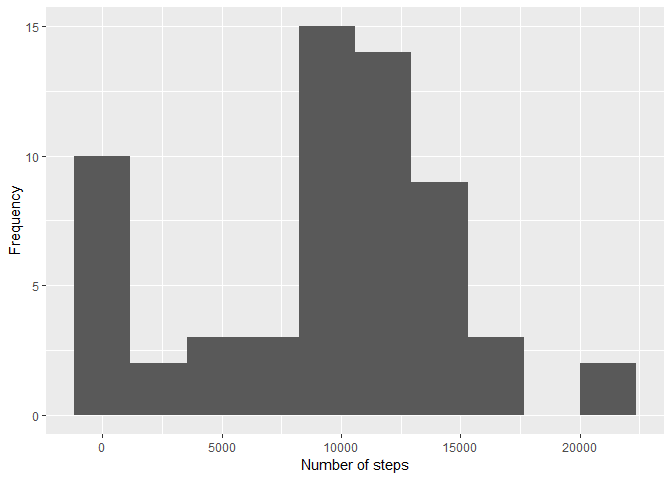
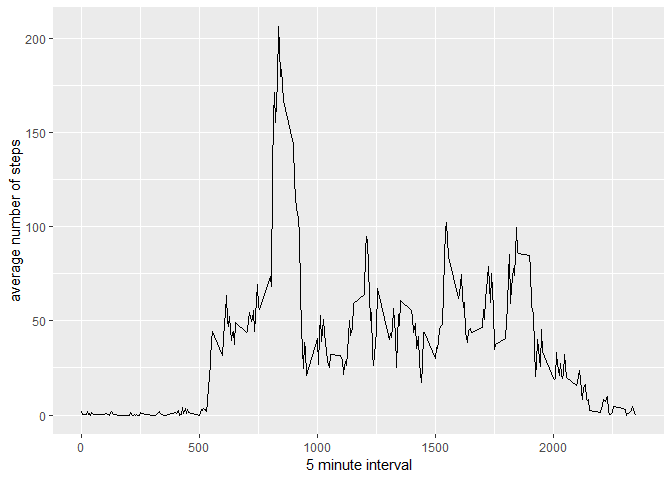
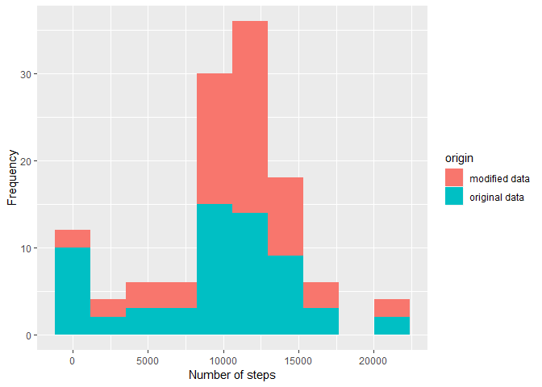
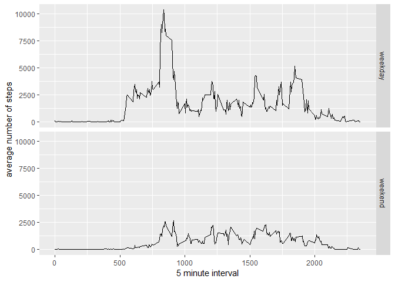

## Loading and preprocessing the data

The document is generated from data aviable in <https://www.coursera.org/learn/reproducible-research/peer/gYyPt/course-project-1>. After the download and unzip, the following code was used to load the data.


```r
activity_data <- read.csv(file = "activity.csv")
```

## What is mean total number of steps taken per day?
To answer this question, the data must be treated. To treat the data and plot the results, the packages *dplyr* and *ggplot2* were added to the program.


```r
if (!"dplyr" %in% installed.packages()) install.packages("dplyr")
library(dplyr)
library("ggplot2")
```

After this, the data was splitted and the median and mean  were generated using the code below:


```r
step_per_day <- activity_data %>%
                 group_by(date) %>%
                 summarise(sum_step = sum(steps,na.rm = TRUE))
mean_per_day <- mean(step_per_day$sum_step)
mean_per_day
```

```
## [1] 9354.23
```

```r
median_per_day <- median(step_per_day$sum_step)
median_per_day
```

```
## [1] 10395
```

In order to observe the distribution of the number of steps in a day, an histogram was plotted for better visualization of data.

```r
qplot(x=sum_step,data=step_per_day,bins=10,xlab = "Number of steps",ylab = "Frequency")
```

<!-- -->

## What is the average daily activity pattern?
The data must be treated again, but now using the following code.

```r
mean_step_per_period <- activity_data %>%
                 group_by(interval) %>%
                 summarise(mean_step = mean(steps,na.rm = TRUE))
```

A time series plot was made with it and is presented below.

```r
qplot(x=interval,y=mean_step,data=mean_step_per_period,geom="line",xlab="5 minute interval",ylab = "average number of steps")
```

<!-- -->

To find which 5 minute interval contains the higher number of steps, the function *which.max* was used

```r
with(mean_step_per_period,(interval[which.max(mean_step)]))
```

```
## [1] 835
```

## Imputing missing values

First it was computed the number of NA contained in original data


```r
sum(is.na(activity_data$steps))
```

```
## [1] 2304
```

To treat the NA values, the approach used was to use the average of number of steps in that time interval. The new table was stored in *activity_data_corrected* variable


```r
row_activity_without_NA <- filter(activity_data,!is.na(steps))
activity_data_corrected <- merge(activity_data,mean_step_per_period,all.x = TRUE) %>%
                           filter(is.na(steps)) %>%
                           mutate(steps=mean_step) %>%
                           select(-mean_step) %>%
                           bind_rows(row_activity_without_NA) %>%
                           arrange(date,interval)
```

Whith this new table, the variable *step_per_day* was recalculated, and the new value is called *step_per_day_corrected*. Also the *mean_per_day_corrected* and the *median_per_day_corrected* were computed. 


```r
step_per_day_corrected <- activity_data_corrected %>%
                 group_by(date) %>%
                 summarise(sum_step = sum(steps,na.rm = TRUE))
mean_per_day_corrected <- mean(step_per_day_corrected$sum_step)
mean_per_day_corrected
```

```
## [1] 10766.19
```

```r
median_per_day_corrected <- median(step_per_day_corrected$sum_step)
median_per_day_corrected
```

```
## [1] 10766.19
```
The value is higher for both, mean and median.

To compare graphically the modified data with the original one, a new data frame was created and an histogram was plotted. In each column the value is higher than before, what is expected, but the highest column has changed. 


```r
step_per_day_edited <- mutate(step_per_day,origin="original data")
step_per_day_corrected_edited <- mutate(step_per_day_corrected,origin="modified data")
step_per_day_complete <- bind_rows(step_per_day_edited,step_per_day_corrected_edited)

qplot(x=sum_step,data=step_per_day_complete,bins=10,xlab = "Number of steps",ylab = "Frequency",fill=origin)
```

<!-- -->

## Are there differences in activity patterns between weekdays and weekends?

The modified data was used to answer this question. To divide properly the data, a new row is added to the dataset


```r
day <- 1:length(activity_data[,1])
day[] <- "weekday"
days <- weekdays(as.Date(activity_data$date))
weekendays_id <- which(days=="sábado"|days=="domingo") # Names in portuguese
day[weekendays_id] <- "weekend"
activity_data_corrected_weekdays <- mutate(activity_data_corrected,day_type=day)
```

And the the  process to create the time series was made again, but this time using the function *aggregate* to group the elements properly, After this, the result was plotted.


```r
mean_step_per_period_corrected_weekdays<-with(activity_data_corrected_weekdays,aggregate.data.frame(as.numeric(steps),by=list(interval,day_type),sum))
colnames(mean_step_per_period_corrected_weekdays) <- c("interval","day_type","steps")
qplot(x=interval,y=steps,data=mean_step_per_period_corrected_weekdays,geom="line",facets = day_type~.,xlab="5 minute interval",ylab = "average number of steps")
```

<!-- -->

According to the graphic The activity during the weekend is less intense than during the weekdays.
